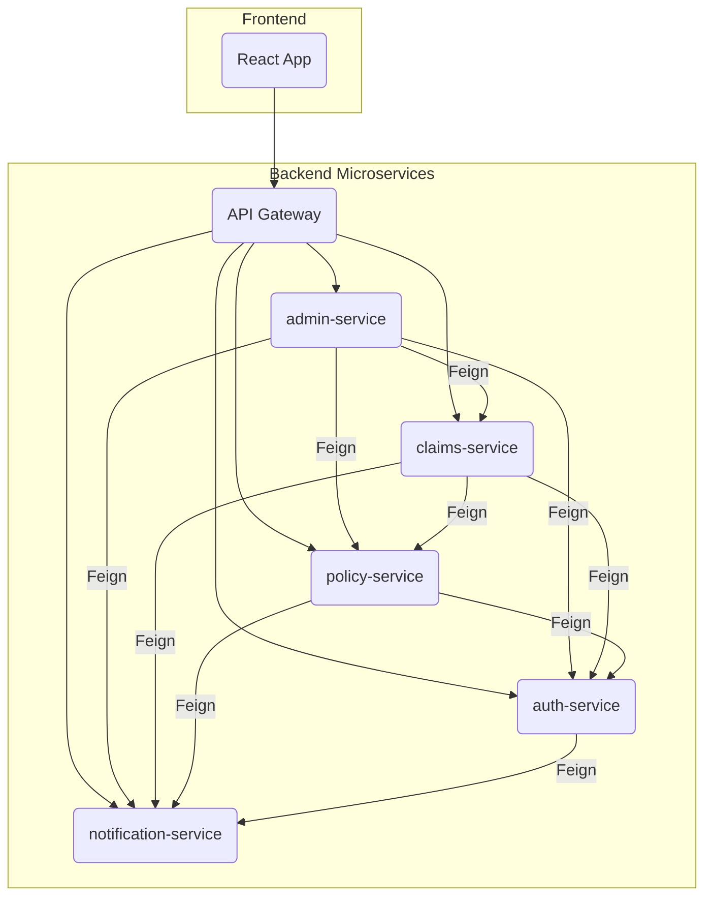

# Feign Client (Synchronous Communcation) in SmartSure

In the **SmartSure** project, we use **OpenFeign** to make microservices talk to each other **synchronously**. It allows one service to call another service as if it were just a regular Java method.

---

## 1. What is Feign Client?

Feign is a **Declarative REST Client**. 
-   **Declarative** means you just define an "Interface" and describe the URL, and Spring Boot handles the rest.
-   **Synchronous** means the service **stops and waits** for the answer (unlike RabbitMQ, which is "fire and forget").

---

## 2. Why use Feign Client?

1.  **Simplicity**: You don't have to write complex `RestTemplate` code with URLs, headers, and error handling. You just call a Java method.
2.  **Eureka Integration**: Feign automatically looks up other services (like `AUTH-SERVICE`) using our Eureka Server. You don't need to hardcode IP addresses.
3.  **Clean Code**: It keeps your business logic clean because it looks like you are calling a local service.

---

## 3. Real-World Use Cases in SmartSure

Feign is used extensively across the SmartSure application for synchronous, direct communication between services. Here are the key interactions:

| Calling Service | Target Service | Feign Client Interface | Purpose |
| :--- | :--- | :--- | :--- |
| **admin-service** | `policy-service` | `PolicyFeignClient` | To manage policies (e.g., view, update). |
| | `claims-service` | `ClaimsFeignClient` | To manage claims (e.g., approve, reject). |
| | `auth-service` | `AuthFeignClient` | To fetch user details. |
| | `notification-service`| `NotificationFeignClient`| To trigger notifications. |
| **claims-service** | `policy-service` | `PolicyClient` | To validate policy details when a claim is filed. |
| | `notification-service`| `NotificationClient` | To send notifications about claim status updates. |
| | `auth-service` | `AuthClient` | To get user information related to a claim. |
| **policy-service** | `notification-service`| `NotificationClient` | To send notifications when a policy is created or updated. |
| | `auth-service` | `AuthClient` | To fetch user data for policy creation. |
| **auth-service** | `notification-service`| `NotificationClient` | To send welcome emails or other authentication-related notifications. |

---

## 4. Technical Implementation ("How it's coded")

### The Client Interface
Here are a few examples of how Feign clients are defined in the project:

**In `claims-service` -> `PolicyClient.java`:**
```java
@FeignClient(name = "policy-service", path = "/api")
public interface PolicyClient {
    // Methods to interact with policy-service
}
```

**In `policy-service` -> `AuthClient.java`:**
```java
@FeignClient(name = "AUTH-SERVICE", path = "/api/auth") // Points to the other service
public interface AuthClient {
    
    @GetMapping("/users/{id}") // The REST endpoint to call
    UserDTO getUserById(@PathVariable("id") Long id);
}
```

### Using the Client
In a service implementation (e.g., `PolicyCommandServiceImpl.java`):
```java
// It looks like a normal local method call!
UserDTO user = authClient.getUserById(userId);
String email = user.getEmail();
```

---

## 5. Feign vs RabbitMQ (When to use which?)

| Feature | Feign Client (REST) | RabbitMQ (Messaging) |
| :--- | :--- | :--- |
| **Mode** | **Synchronous** (Wait for response) | **Asynchronous** (Fire and forget) |
| **Analogy** | A Phone Call (Interactive) | Sending a Letter (Delayed) |
| **Best For** | Getting data *now* (e.g., Fetching a user) | Triggering a task *later* (e.g., Sending email) |
| **Dependency** | Both services must be UP. | Services can be DOWN (RabbitMQ holds it). |

---

## 6. Visual Flow of Feign

Here is a diagram showing all the Feign communication paths between your services:



