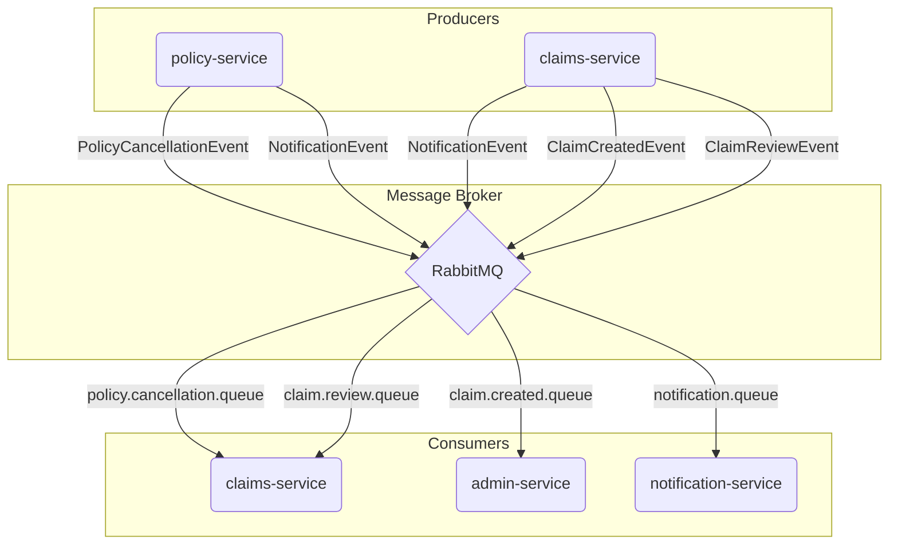

# RabbitMQ (Messaging & Events) in SmartSure

In the **SmartSure** project, we use **RabbitMQ** as our Message Broker. It acts like a digital post office, allowing different microservices to talk to each other asynchronously.

---

## 1. Why use RabbitMQ?

1.  **⚡ Instant Responsibility**: If the Policy Service had to send a real email during a payment, the user would see a loading spinner for 5 seconds. With RabbitMQ, the service just "mails a letter" and returns success immediately.
2.  **🧩 Decoupling**: The Payment logic doesn't need to know how the Email logic works. It just emits an event.
3.  **🛡️ Reliability**: If the Notification Service is temporarily down, RabbitMQ holds the messages in a **Queue**. Once the service is back, it processes them—so no customer ever misses an important email.

---

## 2. Core Concepts (The "Post Office" Analogy)

| Concept | Analogy | Description |
| :--- | :--- | :--- |
| **Producer** | The Sender | The service that sends information (e.g., Policy Service). |
| **Exchange** | The Post Office | Receives messages and decides which "Mailbox" (Queue) to put them in. |
| **Routing Key** | The Address | A label (like `notification.email`) that tells the Exchange where to send the mail. |
| **Queue** | The Mailbox | A storage area where messages wait to be picked up by a Consumer. |
| **Consumer** | The Recipient | The service that reads and acts on the message (e.g., Notification Service). |

---

## 3. Real-World Use Cases in SmartSure

RabbitMQ is central to our asynchronous communication strategy, enabling decoupled and resilient operations. Here are the primary event flows:

| Producer Service | Event / Message | Exchange | Routing Key | Consumer Service(s) | Queue(s) | Purpose |
| :--- | :--- | :--- | :--- | :--- | :--- | :--- |
| **policy-service** | `PolicyCancellationEvent` | `policy.exchange` | `cancellation.routing.key` | **claims-service** | `policy.cancellation.queue` | To trigger the Policy Cancellation Saga, ensuring claims are handled correctly when a policy is canceled. |
| **policy-service** | `NotificationEvent` | `notification.exchange` | `notification.email` | **notification-service** | `notification.queue` | To send notifications (e.g., email) when a policy is created or updated. |
| **claims-service** | `NotificationEvent` | `notification.exchange` | `notification.send` / `notification.email` | **notification-service** | `notification.queue` | To send notifications about claim status updates (e.g., filed, approved, rejected). |
| **claims-service** | `ClaimCreatedEvent` | `claim.exchange` | `claim.created.routing.key` | **admin-service** | `claim.created.queue` | To notify the admin service that a new claim has been created and requires review. |
| **claims-service** | `ClaimReviewEvent` | `claim.exchange` | `claim.review.routing.key` | **claims-service** | `claim.review.queue` | (Internal) To queue claims for internal review processes. |

---

## 4. Technical Implementation ("How it's coded")

### The Producer (Sending a message)
In `policy-service`'s `PolicyCommandServiceImpl.java`, a cancellation event is sent:
```java
rabbitTemplate.convertAndSend(
    RabbitMQConfig.POLICY_EXCHANGE, 
    RabbitMQConfig.CANCELLATION_ROUTING_KEY, 
    new PolicyCancellationEvent(up.getId(), up.getUserId(), LocalDateTime.now())
);
```

### The Consumer (Receiving a message)
In `claims-service`'s `PolicyCancellationListener.java`, the service listens for cancellation events to act upon them:
```java
@RabbitListener(queues = "policy.cancellation.queue")
public void handlePolicyCancellation(PolicyCancellationEvent event) {
    // Logic to reject active claims for the canceled policy
}
```
In `notification-service`'s `NotificationEventListener.java`, it listens for any notification requests:
```java
@RabbitListener(queues = RabbitMQConfig.NOTIFICATION_QUEUE)
public void handleEmailNotification(NotificationEvent event) {
    // Code to send the real Email/SMS
}
```

---

## 5. Visual Messaging Flow



