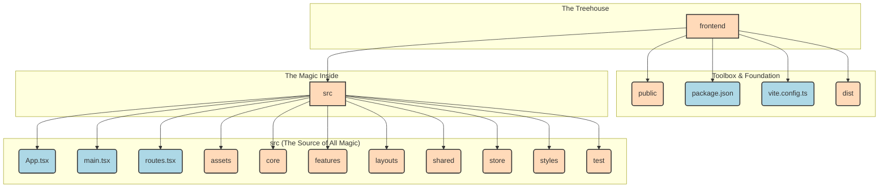

# Welcome to the Frontend Universe! 🚀

Hello, future code explorer! Let's take an exciting journey into the `frontend` folder of our project. Imagine we're building a super cool, interactive treehouse. The `frontend` is everything you can see and play with from the outside—the color of the walls, the shape of the windows, and the fun gadgets inside.

This guide will be your treasure map to understanding how we build the beautiful and user-friendly face of our application.

## Our Treehouse Blueprint (The Folder Structure)

Every well-built treehouse needs a solid plan. Here’s ours:



---

### The Main Folders & Files: A Deeper Dive

#### `frontend`
This is our entire treehouse project! It contains every single piece we need to create the part of the website our users will see and interact with.

---

#### `src` (Source)
This is the heart of our treehouse, where all the construction and magical spells happen. All the code that makes our app work lives here.

*   **`main.tsx`**: The grand entrance! This file is the very first thing that runs. It finds the main door in our HTML and tells our app to start building itself right there.
    *   **Website Example**: When you first load `smartsureinsurance.work.gd`, this file kicks everything off, loading the SmartSure insurance platform into your browser.

*   **`App.tsx`**: This is the main blueprint of our treehouse. It holds the primary layout and brings together all the different parts, like the header, sidebar, and main content area.
    *   **Website Example**: On SmartSure, `App.tsx` holds the sticky navigation bar (with the theme toggle), the main scrollable content area, and the footer.

*   **`routes.tsx`**: Our treehouse's magical map! This file looks at the URL in your browser and decides which room (or page) to show you.
    *   **Website Example**: If you go to `/about`, the router shows the company mission. If you go to `/login`, it shows the secure sign-in portal.

*   **`assets`**: The decoration box! This folder holds all our images, logos, custom fonts, and icons. Anything that adds visual flair to our site.
    *   **Website Example**: The shield-check logo at the top left, or the "Car" and "Heart" icons used for Auto and Health insurance categories.

*   **`core`**: The essential plumbing and wiring of our treehouse. This holds critical, central logic that the entire application depends on, like how we talk to our backend servers.
    *   **Website Example**: The logic that handles secure communication with our backend for checking OTPs during registration.

*   **`features`**: This is like a collection of specialized rooms in our treehouse. Each major feature of our app, like the "User Profile," "Dashboard," or "Claims Page," gets its own folder here. This keeps the code for each feature neat and tidy.
    *   **Website Example**: In SmartSure, the "Insurance Policies," "Claims Tracking," and "User Profile" would each be a separate feature.

*   **`layouts`**: The blueprints for the overall structure of our pages. For example, we might have one layout for pages where the user is logged in (with a sidebar and header) and another for pages when they are logged out (just a simple centered box).
    *   **Website Example**: SmartSure has a clean layout for landing pages and a more focused, split-screen layout for the Login and Registration pages.

*   **`shared`**: A box of reusable LEGO bricks! This folder contains components and functions that are used in many different features across the site, like custom buttons, input fields, or modals.
    *   **Website Example**: The Indigo "Get Started" button. It's the same styled button used for "Sign In," "Submit Contact," and "Verify OTP."

*   **`store`**: The treehouse's brain! This is where we keep track of important information (the "state") that needs to be shared across the entire app. For example, is the user currently logged in? What's in their shopping cart?
    *   **Website Example**: When you toggle the sun/moon icon, the entire app switches to Dark Mode. This "Theme State" is kept in the store so all pages know which colors to show.

*   **`styles`**: The paint and wallpaper! This folder holds our global CSS styles. It defines the overall look and feel, like our color palette, fonts, and the general spacing of things.
    *   **Website Example**: SmartSure uses a vibrant Indigo (`#6366f1`) for primary actions and a sleek Slate-950/Black for its Dark Mode background.

*   **`test`**: The quality control station. We write special code here to automatically test our components and features to make sure they work correctly and don't break when we make changes.

---

#### Other Important Files

*   **`public`**: The front yard. Files in here are directly accessible. The most important one is `index.html`, which is the actual, physical foundation of our treehouse.

*   **`package.json`**: The recipe book and shopping list. This file lists all the third-party tools (like React) that our project needs to work. It also contains scripts for common tasks like starting the app or running tests.

*   **`vite.config.ts`**: The configuration for our super-fast construction crane, Vite. Vite is a modern tool that builds our app and serves it to us while we're developing, and it does it incredibly quickly.

*   **`dist` (Distribution)**: The finished, packaged treehouse, ready for visitors! When we run the "build" command, Vite takes all our `src` code, optimizes it, and bundles it into this folder. These are the files we put on a server for the world to see.

---

## Our Magic Wands: React Hooks ✨

In our React treehouse, we use special tools called **Hooks** to give our components magical abilities. They are functions that let us "hook into" React features. Here are the ones we use:

### `useState`
The Memory Hook! `useState` lets a component remember things.

*   **Analogy**: Imagine you have a light switch on the wall. `useState` is what remembers if the light is currently `ON` or `OFF`. When you flip the switch, you're updating that state.
*   **How we use it**: We use it to remember the text a user is typing into a search bar, or to know if a pop-up window is currently open or closed.
*   **Example from our code (`Dashboard.tsx`):**
    ```javascript
    const [loading, setLoading] = useState(true);
    ```
    Here, the component remembers if it's `loading` data. It starts as `true`, and we set it to `false` when the data arrives.

### `useEffect`
The Action Hook! `useEffect` lets a component do something after it has been rendered (appeared on the screen).

*   **Analogy**: Imagine you have a plant in your room. `useEffect` is like a rule that says: "When the sun comes up (when the component renders), I need to water the plant (perform an action)."
*   **How we use it**: This is perfect for fetching data from a server right after a component loads.
*   **Example from our code (`Dashboard.tsx`):**
    ```javascript
    useEffect(() => {
      // This is where we fetch policies and claims data from the server
      // when the dashboard first appears.
    }, []);
    ```

### `useRef`
The Pointer Hook! `useRef` gives us a way to directly point to a specific element in our treehouse, like a particular window or door, without having to re-render the component.

*   **Analogy**: It's like having a laser pointer. You can point it directly at an object to interact with it (like focusing an input field) without changing anything else in the room.
*   **How we use it**: We can use it to automatically focus on a text input when a page loads, so the user can start typing immediately.
*   **Example from our code (`Profile.tsx`):**
    ```javascript
    const ref = useRef<HTMLDivElement>(null);
    ```
    This gives us a direct reference to a `div` element, which we can then use to maybe measure its size or position on the screen.

We hope this detailed map helps you navigate our frontend universe with confidence! Happy coding! 🌟

